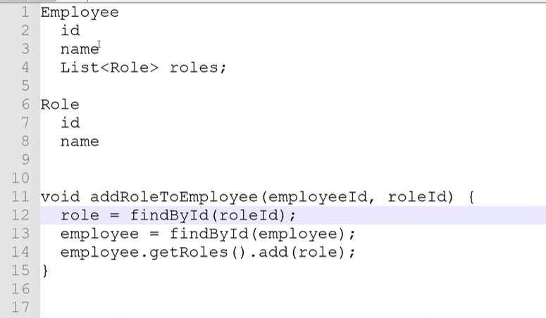
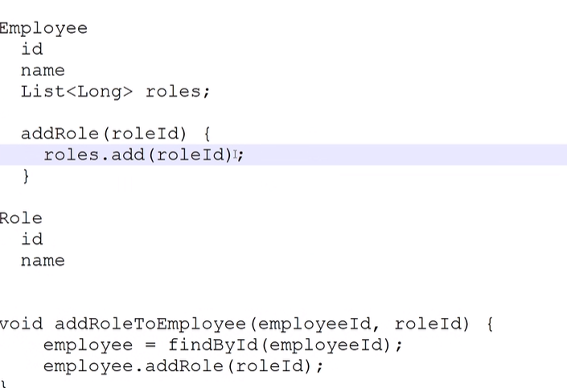
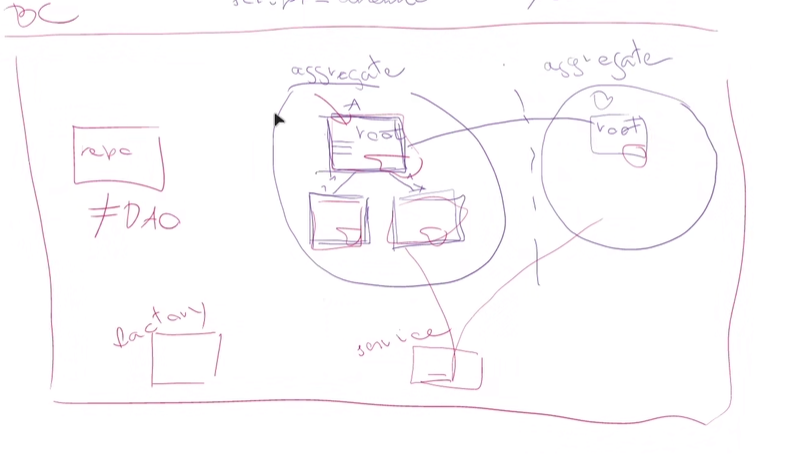
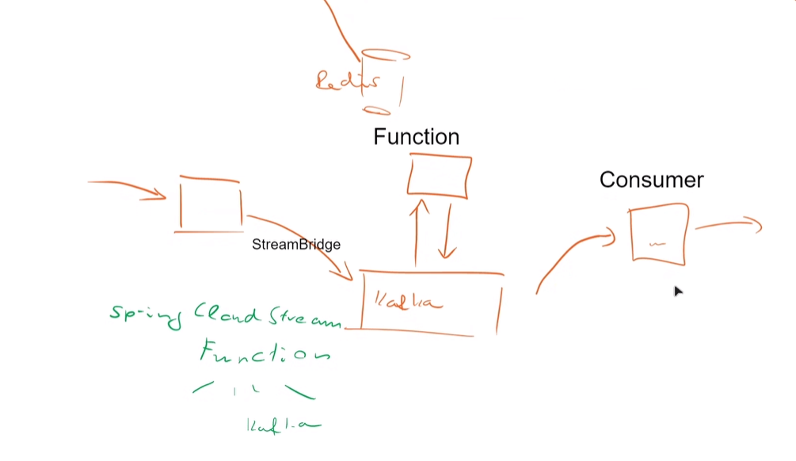
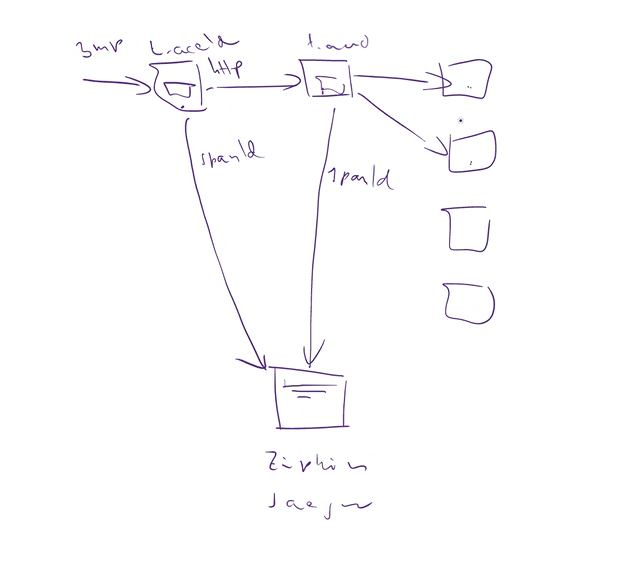

# Bevezető

GitHub repo a forrásokkal és slide-okkal:
https://github.com/Training360/spr-cl-trainin-2023-02-28

## Tematika megjegyzések
Minden tool itt ingyenes ezen a tanfolyamon

### Deprecation Stories

A legmodernebb eszközökkel kezdjük el.
REST már nem túl szeretett.
Sok minden, mint pl. az Open Feign már "deprecated".
Általánosságban nagyon gyorsan elhasználódik a dolgok nagy része...
Domain-Driven Desing kék könyv nem annyira jó ellenben van egy másik könyv a -Distilled postfixű jobb.  
Microservices with Spring Boot and Spring Cloud ISBN 1801072973

### Bemutatkozások

Kolléga:  
Moduláris monolit: modulit, lehet, hogy nem is jó rögtön microservice-eket csinálni.
SOA-ból lettek microservice-ek.   
Mondjuk el az előítéleteinket!

# Üzleti tervezés

Agilis fejlesztés -> monitoring -> DevOps (IaC)  
Funkcionális és nem funkcionális követelmények különválasztása

Hogyan képzelem el az alkalmazást?
Egy "Hello World" alkalmazásnál nincsen értelme még microservice-eket alkalmazni. Egy bonyolult alkalmazás kell ehhez a demozáshoz.  
Skills, szerepkör, tanfolyam: entitások... -> Logikai adatmodell, UML: osztálydiagram (statikus nézet), UseCases, ezekből Epics, Stories (UML Distilled book, easy)
Eventstorming -> BDD tesztek -> Aggregate routes -> API -> Implementálás

## Use Case Diagram

Lényeg: az ügyfél is megértse az ábrát :)

- A rendszer határai
    - Actors (alkalmazott, főnök, HRManager), other systems
- UseCases
   - Beléptetés (alkalmazott)
   - Kurzus (indítás, kiválasztás, jelentkezés, jóváhagyás, teljesítés)
   - Kiléptetés (alkalmazott)

## Event Storming (ha nagyon nem látom át, mi az üzleti folyamat, mik az igények)

- Developed by Alberto Brandolini
- Workshop
- Látható lesz, hogy nincsen egy egységes modell -> a domain számára kell egy reprezentáció mindössze.
- Bounded Context: az adott üzleti szakértő mentális modellje. Ne akarjam, mint fejlesztő megváltoztatni az ő nézőpontját. Ezért különböző bounded context-ek lesznek.

## DDD (Domain Driven Design)

1. Strategic design
   1. Problem Space (Domains) <-> Solution Space
      1. Sub-Domains: Core (amihez a cég a legjobban ért, a bevételi forrás), Supporting (ezzekkel a Core miatt kötelezően kell foglalkozni), Generic (erre vannak kész megoldások -> 3rd party megoldások)
      2. Bounded Contexts in Solution Space (e.g. HR, kurzus, alkalmazott) és ezek között mapping létrehozása szükséges!
         1. Egy ilyen BC-ből lehet egy microservice.
         2. Egy microservice-t egy ember meg tud érteni teljesen
         3. Egy csapat dolgozhat csak egy microservice-en...
         4. Package-be lehet szintén egy moduláris alkalmazást szétszedni.
      3. Bounded Contexts Mapping Strategies:
         1. Partnership (Egybe)
         2. Shared Kernel (Pl. megosztott JAR a régi világban - közös lónak túrós a háta)
         3. Customer - Supplier (meg kell feleni a másiknak, kicsit homályos a szerepfelosztás nekem)
         4. Conformist 
         5. Anti Corruption Layer (lehet külön MS is) az én domain-emre alakítja át. (Pl. protokoll transzformáció)
         6. Open Host Service (Supplier ad egy klienst, pl. a git library)
         7. Published Language (van egy API leíró...)
         8. Separate ways (nem megvalósítható)
      4. Event Storming lépései
         1. üzleti események (Big Picture)
         2. események kiváltói? (Process Modelling)
         3. aggregates? (Business Modelling)
2. Towards Implementation: *Tactical Design Tools* (ezeket az ügyfél határozza meg valójában)
   1. Entity: van azonosítója, egy adatbázis rekord pl., változtatható (mutable) Sprint Bootban JPA entitásnak felel meg. És ebben vannak állapot módosító metódusok, és itt van az üzleti logika is.
      1. _Bad Pattern_ -> Transactional script: entitásnak van getter-setter, és a service állítgatja ezt. Ez nem objektumorientált, ez a megoldás procedurális. (Anemic model)
      
   2. Value Object: immutable, auto-validation, nincsen ID, equals működik, Thread Safe. (pl. primitive burkolóosztály, idő, dátum, `record` típus)
      1. Lehetőleg használjunk ilyen Value Object-eket, tanácsolja a DDD.
      2. JPA `@Embeddable` érdemes `Lazy` módon nem fogja betölteni. Vagy "projection query" a megoldás.
   3. Aggregate-ek között csak ID alapon lehet kommunikálni. Egy aggregate, ami egyetlen tranzakcióban módosul. Van Aggregate root.
    Több Aggregate egy Bounded Contextben, de itt is csak ID alapon kommunikálunk belül is. Ilyenkor mindent betöltünk, mert tipikusan minden részéhez hozzányúlunk...
   Itt a függvény nevek legyenek azonosok a UseCase-ben definiált nevekkel. Pl. felhasználó címváltozás: `move()` (költözik), `correct()` (elgépelték)
   

## C4 Diagrams 

Először lényeges, hogy legyen jelmagyarázat.

1. Szint az a rendszer határai, kontext
2. Konténerek
3. Komponensek
4. Osztályok, kód szint. Nem ad nekünk plusz információt, nem kell erőltetni.

Példák: [https://www.jtechlog.hu/2022/12/19/spring-modulith.html]

# Kódolás

Fontos dolgok:
- Portokat érdemes előre az ábrába beírni, hogy ne legyen összeakadás
- baeldung: java-performance-mapping-frameworks
- Továbbra is érdemes sok (~10000) stringnél StringBuildert készíteni 
- `@SneakyThrows` - kezelendő exceptions-t már nem használunk ma: JPA-ban pl. nincsen már, mert úgyis "feltör". .NET-ben nincsen "checked exception"
- Swagger UI: `<dependency>   <groupId>org.springdoc</groupId>   <artifactId>springdoc-openapi-starter-webmvc-ui</artifactId>   <version>2.0.2</version></dependency>` pom-ba!
- Idempotencia: több minden jöhet, ami hasonló, leellenőrzöm, hogy benne van-e.
- API Composition: Mapper segítségével.
- API Gateway: plusz egy lehet még a belső szolgáltatásokra is...
- A Backend for Frontend fejlesztője inkább a frontend fejlesztő legyen, ő tudja, mit kell a megjelenítéshez rendesen lekérdezni...
- The Clean Architecture Picture
- Spring Cloud Dependency management: nem kell a pom-ba verziószámot megadni, mert "központilag" van kezelve.
## Kafka
- Krafft és Kafdrop alkalmazások, amik segítenek egyszerűsíteni a dolgokat
- Message-oriented Middleware
  - Mi újabbat adott a Kafka? Hogy skálázható és klaszterezhető legyen.
    - Üzenet adatbázis, mindent letárol
  - Correlation ID (mint a REST API) lehet visszajelezni
  - Minden MS rendelkezzen 3 Kafka topic-kal
    - Request
    - Event: ha valami történik a MS-szel, fel lehet rá iratkozni
    - Response
    - Message queue lehet lokálisan is... de ez nem stateless.
  - Redpanda Kafka alternatíva: egyszerűbb, gyorsabb és kompatibilis.
  - 

## OAuth
 - jwt.io token kikódolás (Jason Web Token)
 -  Access token rövid lejáratú, de nem kell folyton belépni, hanem a refresh-tokennel újra bejelentkezteti a rendszerbe a felhasználót.
 -  Keycloak nem támogatja a spring boot 3-at. Ezért a standard OAuth klienst kell használni...
 -  Mi az hogy claim? A JWT-ben lévő mező
 -  Scope? Milyen adatokat kérek le...

## Zipkin

Open Telemetry
Nagyon jó arra, hogy nézzük, ki hogyan kommunikál. Nem is kell tényleg kódolni, mert a Spring Boot 3 alapból tudja. Elég pom.xml-be berakni a megfelelő függőségeket, és propertiest beállítani.  
Alternatíva a Jéger. :) Mindegyik opensource, persze lehet vásárolni hozzá támogatást.

## Reaktív programozás
 - A virtuális thread-ek kiválthatják a reaktív programozást
 - Flux, Mono használata közbülső operátorokkal.
 - Egy szál van, nem várakozik.
 - R2DBC, JOOQ Database driver
 - ReactiveCrudRepository (REPO), `Mono ...` (service)
 - Reactive Webclient

## Sping Cloud Configuration

Adatbázis, mögötte lehet Git vagy Vault server! Tud szólni, és értesíteni az alkalmazásokat, hogy valami a gitben megváltozott.   
Használ egy üzenetküldő middleware-t
- Spring Cloud Config Server, hogyan triggerelődik?
  - Filesystem figyelése
  - Git commit hook
- Ez is egy proxy-val történik, a bean-ek erre a proxy-ra hivatkoznak. Tehát nem az egész applikation kontext indul újra, hanem csak ez a bean.

## Kubernetes

 - Nagyon jó, hogy a docker desktop alapból ad nekünk egy kubernetest
 - Infra elemek, környezetek mehetnek külön namespace-be.
 - Egy podba tegyünk egy konténert lehetőleg, de mehet bele sidecar container:
   - HTTPS hozzáadása
   - Logok elkapása és beküldése az EFK Stackre.
 - Egy pod ugyanazokon a portokon osztoznak meg.
 - A pod az egy ideiglenes dolog, bármikor leállítható, elindítható... stb.
 - Podok elindítására egy magasabb absztrakciós szintet használunk: _Deployment_
 - Rolling update: a régieket nem állítja le, amíg az új változat nem indult el. Ellentéte a recreate.
 - Stateful set: állapottal rendelkező erőforrás. Deployment helyett használható kvázi.
 - A service segít egy stabil hálózati kapcsolat fenntartásában.
 - Kubernetes nem szereti a latest verzió megadásokat...
 - Van egy ilyen maven plugin is, ami csinál egy ocr konténert, nemcsak a dockerfile.
 - Helm: Jinja segítségével többféle felhőkörnyezetbe tud telepíteni... Ez kvázi a kubernetes package managere. Újabb változat a Kustomize.io, ez olyan mint az effective pom a maven számára.
 - ServiceMesh: Techworld with Nana vagy hwsw magyarul ugyanerről a témáról
   - Istio control plane kontrollálja a sidecar envoy proxy-kat...
   - Ingress gateway-t is lehet konfigolni ezzel...

## Gitlab

 - Nagyon egyszerű egy docker comopose-zal indítani egy GitLabot.
 - mwnw maven letöltő... ezért nem kell maven image, elég az openjdk image.
 - központi helyre is lehet cache-t létrehozatni.
---
   
---
# Random Notes out of Context
- Mindig **Spring Boot Reference Documentation**-nel kell kezdeni.
- Egy microservice-ben 5-8 tábla lehet max.
- Annotation JPA "`fetchtype eager`"
- UL: Ubiquitous Language, mindenki az üzlet és az informatikus is megérti.  
Fogalomszótár kellene. Fájdalmas, de behozza az árát. Magyarországon magyarul fejlesztünk. Ha az üzlet nyelve angol, akkor mehet az angol. Persze lehet, hogy a szoftvert eladjuk más országba is, akkor nagyon kell a fogalomszótár.
- JaSypt Java Simplified Encription
- Saga Microservice-en átnyúló üzleti folyamat, elosztott tranzakciókezelés: lehet, hogy monolit kell? Igen...
  - Ez tulajdonképpen a másik iránya az API composition-nek. A felhasználó szeretne olyan command-ot végrehajtani, ami több microservice-t is érint.
  - Event sourcing... Tranzakciók ellenőrzése, Snapshot: pl. banki napi zárás Megoldás: AxonIQ
  - Ezeknek két típusa van:
    - Coreography: mindenki tudja, ki a következő szereplő, lánc
    Rollback? Kompenzáló tranzakció: minden műveletnek megírom az ellentétét, `cancel-`
    - Orchestration: pl. a Spring State Machine, itt van egy főnök. :) Egy állapotátmenet diagramot lehet ezzel leprogramozni
- Netty: aszinkron, reaktív szerver
- Cache eviction: nem változó rendszer változik, cache? Inkább ne cache-elni :)
- Intelligens default értékek Spring nagyon jó tulajdonsága
- Saga csak egy helyütt lehet
  - Camunda Workflow motor... ha túl bonyolult lenne már a Saga. 
  https://www.jtechlog.hu/2014/07/25/pehelysulyu-workflow-activitivel.html
- "Ha valaki microservice-eket akar, akkor muszáj üzenetbuszt használni... :)"
  - CQRS, websocket, poll
- CNCF tanusított cloud eszközök listája.
- 12factor.net érdekes honlap... egyebet nem tudok mondani. :)
- ThreadLocal, minden szálnak vannak saját lokális attribútumai.Egy HTTP Request egy ilyen szál.
- A/B test: két megvalósítás, és a felhasználók egy része az egyiket használja...
- Canary deployment: hasonlóan egy kicsi része a felhasználóknak kapja meg először az új szoftvert
- Continous delivery: "minden commit egy potenciális release", feature flag: még nincsen bekapcsolva a felhasználó számára...
- Docker in Docker: sajnos root felhasználóval kellene futtatni, ami eléggé biztonságtalan, helyette a ugyanazon a unix socketen kommunikálnak és mindenki a host dockerét használja. De így meg az image-ekhez lehet hozzáférni. 
  - Hogyan lehet docker nélkül image-et előállítani: Kaniko vagy a maven egy beállítása. Gitlab ezt támogatja eléggé jól.